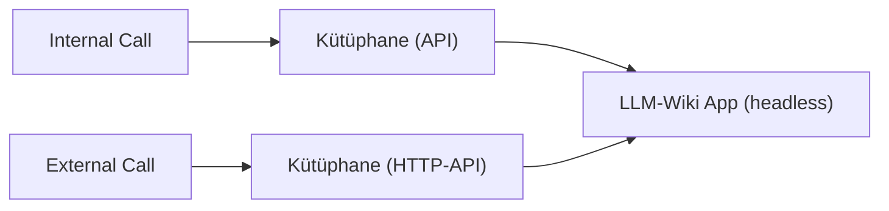
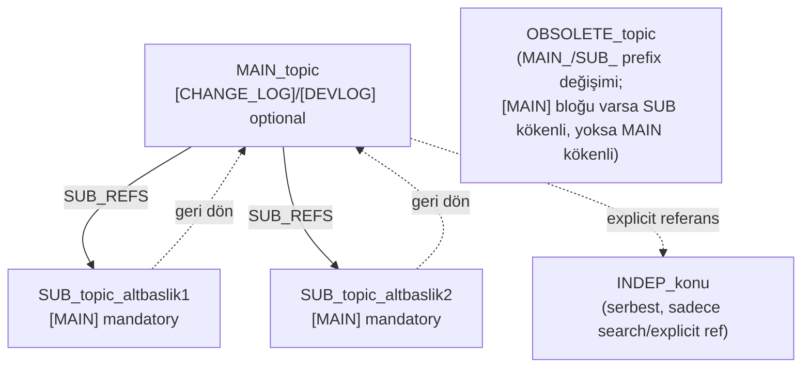

# Wiki Master Plan

## Temel Kural

Sistem bileşenlerinin ve servislerin ihtiyaç duyduğu veri Wiki container'ları üzerinde tutulur. Bu, çalışan bütün işlem birimlerinin (Claude dahil, istisnasız) bilmesi gereken yegane kuraldır: **aradığımız bilgi LLM-Wiki'de.**

## Erişim Sırası

1. **LLM-Wiki'nin mini'si** — önce çekilir.
2. Bu mini'den elde edilen **topic listesi** — üzerinde çalışılan server'da geliştirilen projelerin listesini verir.
3. Bu proje listesi kullanılarak, ihtiyaç duyulan projelerin **mini'leri** yüklenir.

Bu üç adım tamamlandığında, Wiki üzerinde hızlı erişilemeyecek veri kalmaz.

## Sonuç

Bu üç katman (LLM-Wiki mini → proje listesi → proje mini'leri) RAM'de tutulmalıdır — bu, erişim hızı kazandırır.

## Service Point (Endpoint)

Wiki için hayati olan ana fonksiyon service point (endpoint). Wiki internal bir hizmet olduğu için, Wiki erişimi ancak internal yahut 2. bir bridge servis üzerinden olabilir.

## Structure

- **Internal Call** -> Via API (Kütüphane üzerinden) -> LLM-Wiki App (headless)
- **External Call** -> Http-API (Kütüphane kullanarak) -> LLM-Wiki

## LLM-Wiki-Interpreter

LLM-Wiki'ye erişen ara operatör bir instance olursa, hafızası da olabilir. O zaman bir LLM-Wiki-Interpreter gerekliliği açıktır.

Pasif bir yapı olan Interpreter, sadece LLM-Wiki erişim fonksiyonları call edildiğinde, Json configuration dosyası ile belirtilmiş Konu-Layer'larını ve sorgu yanıtlarını RAM'de çalışan yapılara en hızlı erişebileceği tasarımda yerleştirir. İlerleyen sorgularda bunlara wiki'ye erişmeden cevap verir.

Önerilen RAM yapısı: LLM-Wiki mini + Proje başlıkları (Topics) + Proje başlıklarının mini'leri.

Yazılım/uygulama tercihlerine göre değişebilecek olsa da, erişim sınıfına bağlı bir static yapı, verinin RAM'de tutulup erişen herkes tarafından kullanılabilir olmasını sağlar.

### Özet

Interpreter, farklı yazılım dili destekleri veren ve talepleri (Wiki taleplerini) yanıtlayan, bir Static instance içinde belli verileri depolayıp cevaplama hızını arttıran bir kütüphanedir.

## Key Yapısı

Dosya erişim mantığı Key->Context şeklindedir. Key'leri MAIN_, SUB_, INDEP_ şeklinde başlatarak 3'e bölebiliriz. Ana başlık, alt başlık, independent şeklinde 3 key türü olur. Ana başlığın içerisinden alt başlıkları refere ederiz. Independent'ları da gerektikleri yerde refere ederek erişiriz, yoksa search olmadıkça ayak altında dolaşmazlar.

Sub'da da main referlenmeli ki geri gidebilesin. Böylece bunları görüntülerken de açılan akordiyon menü kullanabiliriz.

