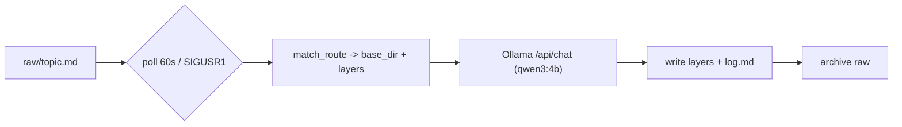

# DSI-Wiki — Architecture

Multi-layer wiki generation and serving system. Raw notes dropped into a watched directory are
turned into structured documentation layers (`documentation` / `llm` / `minified` / `brief`,
plus opt-in `changelog` / `devlog`) by a local LLM over Ollama, and served over HTTP, MCP and a
web UI from a single gateway. One ingest daemon serves any number of wiki instances.

## Components

Exactly two real running processes — see [naming-conventions.md](naming-conventions.md) for why
MCP/UI are not separate services.

- **`CODE/ingest/`** — `DSI-Wiki-Ingest-Service-Class.py`: polling daemon (default 60s, or
  `SIGUSR1`) that routes each `raw/<topic>.md` note to an instance and writes its layers via
  Ollama `/api/chat` (`stream:false`, `think:false`). Also `DSI-Wiki-Nightly-FactCheck.py`
  (scheduled consistency pass, 03:00).
- **`CODE/gateway/`** — `api_app.py` (pure functions: `load_instances`, `get_content`,
  `list_topics`, `search`) + `DSI-Wiki-HTTP-Server.py`: the combined **API / MCP / UI ASGI
  gateway on port 8430**, mounting `CODE/mcpserver/` and `CODE/ui/` as sub-apps at `/api`,
  `/mcp`, `/http`.
- **`CODE/mcpserver/`** — `DSI-Wiki-MCP-Server.py`: MCP tools `wiki_get` / `wiki_search` /
  `wiki_list_topics` (all require an `instance` parameter). For external clients only —
  internal consumers use the CLIs below.
- **`CODE/ui/`** — `DSI-Wiki-UI-Server.py`: web UI.
- **`CODE/common/`** — `ollama_lock.py`: cross-process VRAM queue so ingest, nightly fact-check,
  and admin tools never contend for the GPU at once.
- **`SKILLS/cli/`** — local CLIs importing `gateway.api_app` directly (no server round-trip):
  `wiki_get.py`, `wiki_topics.py`, `wiki_search.py`, `topic_ops.py` (delete/rename),
  `internal_scan.py` (doc-vs-minified drift scan), `provenance.py`, `wiki_maintain.py`,
  `wiki_write.py`, `wiki_obsidian_link.py`.
- **`TOOLS/`** — `DSI-Wiki-Service-Supervisor.py` (generates the routing config from instance
  JSONs, installs/keeps the systemd services healthy) plus maintenance/migration/one-off
  scripts, not part of the running system.
- **`JSONS/instances/`** — one JSON per wiki instance (see Setup in `SERVICES/DEPLOY.md` /
  `README.md`).
- **`SKILLS/`** — SKILL.md definitions for agent consumption (`dsi-wiki-read`,
  `dsi-wiki-internal-scan`, `dsi-wiki-provenance`) plus the CLI implementations above.

## Raw vs. base directories

- **Raw is global** — one drop directory for the whole service (`LLM_WIKI_RAW_DIR` / the
  Docker-path `WIKI_RAW_DIR`); after successful ingest a note moves to the archive dir.
- **Base is per-instance** — each `JSONS/instances/<name>.json` sets its own `base_dir`, under
  which that instance's layer folders (`documentation/`, `llm/`, `minified/`, `brief/`, …) are
  written.
- **Routing (raw → instance):** topic name is matched against each enabled instance's `keyword`
  (substring); a note can force-route with a `Tags: <tag>` line. No match falls back to
  `default_base_dir` in the generated `JSONS/DSI-Wiki-Multi-Server-Config.json`.
- **`JSONS/DSI-Wiki-Multi-Server-Config.json` is generated, never hand-edited** — re-run the
  supervisor (`TOOLS/DSI-Wiki-Service-Supervisor.py`) after any instance change.

## Layers

Defined per instance in the `layers` field of `JSONS/instances/<name>.json`:

- `documentation` — free-form per instance: custom `prompt` and/or literal layer instructions
  (see `DOCS/Documentation_Content_Requirements.md` and `DOCS/Documentation_Example_schema.md`
  for the MAIN_/SUB_/INDEP_/OBSOLETE_ key format).
- `llm`, `minified`, `brief`, `changelog`, `devlog` — standard layers resolved from the instance
  JSON; per-topic `topic_layers` entries can override with literal `D:` / `C:` / `R:` / `X:`
  directives.
- Instances with no `layers` field fall back to the fixed 3-layer
  (`documentation`/`llm`/`minified`) behavior.

## Lifecycle



## Usage

**Write:** drop a note at `raw/<topic>.md` — picked up within one poll interval, or immediately
via `SIGUSR1` to the ingest process.

**Read (internal, CLI — the standard path):**

```
DSI-wiki-topics [--instance <name>] [--layer minified]
DSI-wiki-get <topic> [--instance <name>] [--layer minified]
DSI-wiki-search <query> [--instance <name>] [--layer all]
DSI-wiki-rename <old> <new>        # across all layers
DSI-wiki-delete <topic>            # across all layers
DSI-wiki-internal-scan --topic <t> | --all   # doc-vs-minified drift report
```

(Wrappers in `~/.local/bin/` -> `SKILLS/cli/*.py`; they read the layer files directly.)

**Read (external):** HTTP gateway on `:8430` — `GET /api/instances`,
`GET /api/topics?instance=&layer=`, `GET /api/wiki?instance=&topic=&layer=`,
`GET /api/search?instance=&q=&layer=`, `GET /api/status` (see `STATUS.json`); MCP at `/mcp` with
the same three tools.

**Add an instance:** new JSON under `JSONS/instances/`, then re-run the supervisor.

## Branches

- `production` — running, stable code (no `TOOLS/`)
- `development` — active development
- `documentation` — full version of the docs
- `LLM` — condensed bullet summary for quick context transfer
- `Mini` — single-paragraph gist
