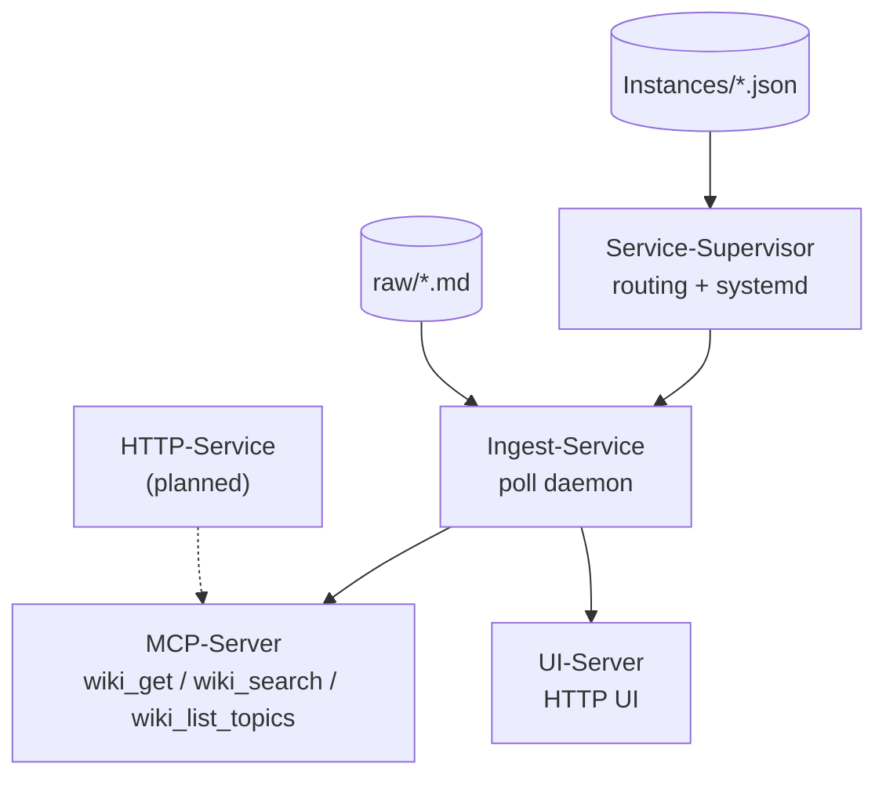
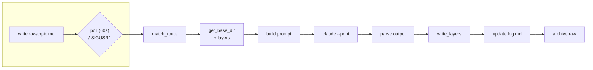
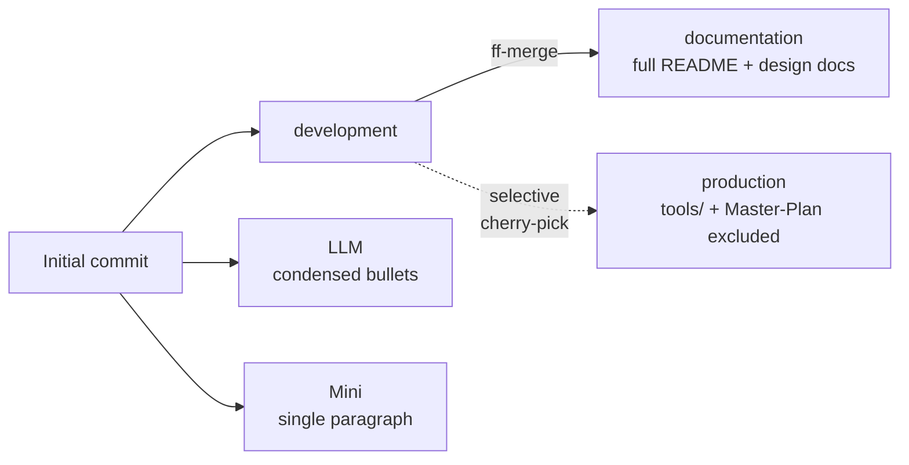

# DSI-Wiki — Real Filled-In Examples (MAIN_ / SUB_ / INDEP_)

Companion to `Documentation_Example_schema.md`. That file defines the placeholder shape;
this file shows what real `[CONTEXT]` content looks like once filled in, using this repo
itself as the case study. Diagrams follow the "documentation-layer" content standard
(Overview → diagram → detail → changelog), matching the format used by the templates in
`~/wiki/templates/`.

---

## MAIN_DSI-Wiki

```
Key: MAIN_DSI-Wiki
Title: DSI-Wiki

[CONTEXT]
```

### Overview
Multi-layer wiki generation and serving system. Turns raw notes into structured
documentation via `claude --print`, and manages multiple project instances from a single
ingest daemon. This MAIN topic is DSI-Wiki documenting itself, alongside the other 9 Ana
Başlık projects it also documents.

### Component Graph



### Schema Table
| Field | Type | Description | Required |
|---|---|---|---|
| `layers` | object | Per-instance layer config (`documentation`/`llm`/`minified`/`changelog`/`devlog`) | No — falls back to `LEGACY_LAYERS` |
| `base_dir` | string | Where this instance's layer output is written | Yes |
| `keyword`/`tag` | string | Route-matching for incoming raw notes | No |

```
[SUB_REFS]
- SUB_DSI-Wiki_MCP-Server
- SUB_DSI-Wiki_UI-Server
- SUB_DSI-Wiki_Ingest-Service
- SUB_DSI-Wiki_Service-Supervisor
- SUB_DSI-Wiki_HTTP-Service
- SUB_DSI-Wiki_Key-Schema
- SUB_DSI-Wiki_Tools

[CHANGE_LOG]
- 2026-07-17: README.md and Documentation_Example_schema.md translated to English
- 2026-07-17: Lifecycle diagram in README switched to a bent LR layout for more room per node
- 2026-07-17: production/development/documentation/LLM/Mini branch scheme pushed to GitLab

[DEVLOG]
- 2026-07-17: Running `git status`/`git add -A` inside DSI-Wiki before it had its own `.git`
  would have resolved to the parent `/home/ozan` repo — caught before executing, fixed by
  `git init` directly inside DSI-Wiki.
- 2026-07-17: GitLab API 404 on `/groups/darkstarinitiative/projects` — `darkstarinitiative`
  is a user namespace, not a group. Fixed by looking up `namespace_id` via `/api/v4/namespaces?search=`.
- 2026-07-17: `git cherry-pick --continue --no-edit -q` failed with a usage error (bad flag
  combination) — retried as two separate, correctly-ordered flags.
```

---

## SUB_DSI-Wiki_Ingest-Service

```
Key: SUB_DSI-Wiki_Ingest-Service
Title: Ingest-Service

[MAIN]
MAIN_DSI-Wiki

[CONTEXT]
```

### Overview
The live poll daemon (`DSI-Wiki-Ingest-Service-Class.py`). Watches `raw/`, matches each file
to a route, resolves that route's `layers` config, builds one `claude --print` prompt
covering every configured layer, parses the delimited output, and writes each layer with
either `overwrite` or `append` semantics.

### Lifecycle



### Schema Table
| Layer | Mode | Standard? |
|---|---|---|
| `documentation` | overwrite | No — instance-defined `prompt`(+`template`) |
| `llm` | overwrite | Yes |
| `minified` | overwrite | Yes |
| `changelog` | append (new entry only) | Yes |
| `devlog` | append (new entry only) | Yes |

### Code Example
```python
STANDARD_LAYERS["changelog"] = {
    "instructions": "ONLY the new entry for this update (Keep a Changelog style)...",
    "mode": "append",
}
```

<details>
<summary>Known limitations</summary>

- No instance JSON currently defines a real `layers` block yet — everything still runs
  through the `LEGACY_LAYERS` fallback path in production.
- `Multi-Server-Config.json` in git is a committed skeleton; the real one is generated
  locally by the supervisor and never committed.

</details>
```
(no [SUB_REFS] — SUB_ topics don't have further children in this schema)
```

---

## INDEP_GitLab-Branch-Convention

```
Key: INDEP_GitLab-Branch-Convention
Title: GitLab Branch Convention (production/development/documentation/LLM/Mini)

[CONTEXT]
```

### Overview
A reusable 5-branch pattern, not specific to any one MAIN_ topic — applies the wiki's own
documentation/llm/minified layering philosophy to a code repository's *own* self-description.
`production`/`development` are code-maturity branches; `documentation`/`LLM`/`Mini` are
content-depth variants of the same README, meant for bootstrapping context into remote
tasks/agents that have no MCP connection and shouldn't need one just to see "what is this repo."

### Branch Graph



### Schema Table
| Branch | Content depth | Diverges via |
|---|---|---|
| `production` | full code, minimal docs | cherry-pick only what's approved |
| `development` | full code + full docs | primary working branch |
| `documentation` | = development, always ff-merged | never diverges from development |
| `LLM` | condensed bullets | branched once, updated manually |
| `Mini` | one paragraph | branched once, updated manually |

<details>
<summary>Why not just merge everything into production?</summary>

Some content (Wiki-Master-Plan.md, `_Python/tools/`) is intentionally internal-only —
maintenance scripts and planning docs that a stable/running deployment doesn't need.
Excluding them is done two ways: (1) simply never merging those specific commits into
`production`, and (2) a `production`-only `.gitignore` rule as a redundant safety net.

</details>
```
(no [SUB_REFS] — INDEP_ topics are reached only via explicit reference or search)
```
