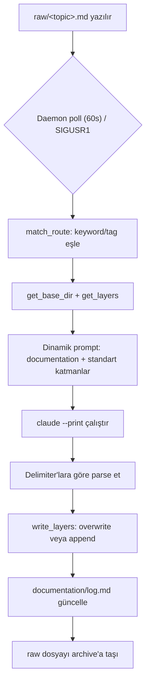

# DSI-Wiki

Çok katmanlı (documentation / llm / minified + değişken ek katmanlar — changelog, devlog vb.) wiki üretim
ve sunum sistemi. Ham notlardan (`raw/`) başlayarak `claude --print` CLI üzerinden yapılandırılmış
dokümantasyon üretir; birden fazla proje/instance'ı tek bir ingest servisinde yönetir.

## Branch Yapısı

- `production` — çalışan, stabil kod
- `development` — aktif geliştirme
- `documentation` — bu README'nin tam hali (bu dosya)
- `LLM` — sıkıştırılmış/madde işaretli özet — context'e MCP bağlantısı olmadan hızlı aktarım için
  (özellikle uzak makinedeki task'lara: context inject edilemiyorsa bu branch "neyle muhattap
  olduğunu" anlatır)
- `Mini` — tek paragraf, minimum bilgiyle "içinde ne var" görebilmek için

## Yapı

- `_Python/` — uygulama kodu
  - `DSI-Wiki-MCP-Server.py` — MCP sunucusu (`wiki_get` / `wiki_search` / `wiki_list_topics`)
  - `DSI-Wiki-UI-Server.py` — HTTP UI
  - `IngestService/` — canlı ingest daemon'u (`DSI-Wiki-Ingest-Service-Class.py`) + routing config
  - `DSI-Wiki-Service-Supervisor.py` — instance JSON'larından routing config üretir, systemd
    servislerini kurar/sağlıklı tutar
  - `HTTPService/` — (planlanan) birleşik HTTP sunucu config'i
- `Instances/` — her wiki sistemi için bir JSON dosyası (bkz. Kurulum)
- `Documentation_Example_schema.md` — MAIN_/SUB_/INDEP_/OBSOLETE_ key formatları, placeholder şablonları

## Kurulum

1. Repoyu klonla
2. `Instances/default.json`'ı kopyala, kendi instance'ın için doldur (`name`, `base_dir`, opsiyonel
   `keyword`/`tag`, `enabled: true`)
3. `_Python/IngestService/.env` dosyasını oluştur — RAW/ARCHIVE dizinleri, poll interval vb.
4. `python3 _Python/DSI-Wiki-Service-Supervisor.py` çalıştır — routing config'i üretir, systemd
   servisini kurar/başlatır

## İş Akışı (Lifecycle)

## Kullanım

- Ham not eklemek: `raw/<topic>.md` dosyasına yaz — ingest daemon'u otomatik işler (poll interval
  kadar sürede)
- Wiki'yi okumak: MCP üzerinden `wiki_get(topic, layer="documentation"|"llm"|"minified"|...)`
- Instance eklemek: `Instances/` altına yeni JSON, sonra supervisor'ı tekrar çalıştır
- Katman şeması: her instance JSON'unun `layers` alanında tanımlanır — `documentation` serbest
  `prompt`(+opsiyonel `template` md dosyası), `llm`/`minified`/`changelog`/`devlog` kodda sabit
  (`standard: true`), tanımsız instance'lar eski (sabit 3 katman) davranışa düşer.
