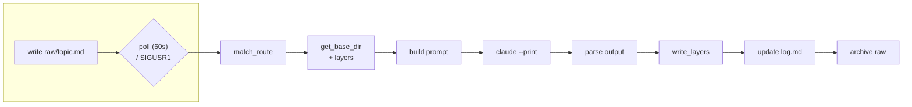

# DSI-Wiki

Multi-layer (documentation / llm / minified + configurable extra layers — changelog, devlog,
etc.) wiki generation and serving system. Starting from raw notes (`raw/`), it produces structured
documentation via the `claude --print` CLI; manages multiple projects/instances from a single
ingest service.

## Branch Structure

- `production` — running, stable code
- `development` — active development
- `documentation` — full version of this README (this file)
- `LLM` — condensed, bullet-point summary — for quick context transfer without an MCP connection
  (especially for tasks on remote machines: if context can't be injected directly, this branch
  explains "what you're dealing with")
- `Mini` — single paragraph, minimum info to see "what's inside" at a glance

## Structure

- `_Python/` — application code
  - `DSI-Wiki-MCP-Server.py` — MCP server (`wiki_get` / `wiki_search` / `wiki_list_topics`)
  - `DSI-Wiki-UI-Server.py` — HTTP UI
  - `IngestService/` — live ingest daemon (`DSI-Wiki-Ingest-Service-Class.py`) + routing config
  - `DSI-Wiki-Service-Supervisor.py` — generates routing config from instance JSONs, installs and
    keeps systemd services healthy
  - `HTTPService/` — read-only HTTP bridge (`DSI-Wiki-HTTP-Server.py`) for external callers
    that can't speak MCP; instance-scoped `/instances`, `/topics`, `/wiki`, `/search`
- `Instances/` — one JSON file per wiki system (see Setup)
- `Documentation_Example_schema.md` — MAIN_/SUB_/INDEP_/OBSOLETE_ key formats, placeholder templates

## Setup

1. Clone the repo
2. Copy `Instances/default.json`, fill it in for your instance (`name`, `base_dir`, optional
   `keyword`/`tag`, `enabled: true`)
3. Create `_Python/IngestService/.env` — RAW/ARCHIVE directories, poll interval, etc.
4. Run `python3 _Python/DSI-Wiki-Service-Supervisor.py` — generates the routing config, installs
   and starts the systemd service

## Lifecycle

## Usage

- Add a raw note: write to `raw/<topic>.md` — the ingest daemon picks it up automatically
  (within one poll interval)
- Read the wiki: via MCP `wiki_get(topic, layer="documentation"|"llm"|"minified"|...)`, or over
  plain HTTP (`python3 _Python/HTTPService/DSI-Wiki-HTTP-Server.py`): `GET /instances`,
  `GET /topics?instance=<name>&layer=<layer>`, `GET /wiki?instance=<name>&topic=<topic>&layer=<layer>`,
  `GET /search?instance=<name>&q=<query>&layer=<layer|all>`
- Add an instance: new JSON under `Instances/`, then re-run the supervisor
- Layer schema: defined in each instance JSON's `layers` field — `documentation` is free-form
  (`prompt` + optional `template` md file), `llm`/`minified`/`changelog`/`devlog` are fixed in
  code (`standard: true`); instances without a `layers` field fall back to the legacy fixed
  3-layer behavior.
