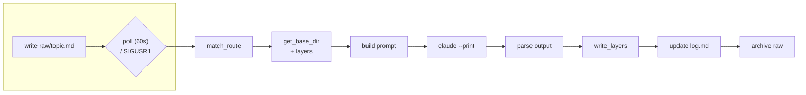

# DSI-Wiki

Multi-layer (documentation / llm / minified + configurable extra layers — changelog, devlog,
etc.) wiki generation and serving system. Starting from raw notes (`raw/`), it produces structured
documentation via the `claude --print` CLI; manages multiple projects/instances from a single
ingest service.

## Branch Structure

- `production` — running, stable code
- `development` — active development
- `documentation` — full version of this README (this file)
- `LLM` — condensed, bullet-point summary — for quick context transfer without an MCP connection
  (especially for tasks on remote machines: if context can't be injected directly, this branch
  explains "what you're dealing with")
- `Mini` — single paragraph, minimum info to see "what's inside" at a glance

## Structure

- `_Python/` — application code
  - `DSI-Wiki-MCP-Server.py` — MCP server (`wiki_get` / `wiki_search` / `wiki_list_topics`)
  - `DSI-Wiki-UI-Server.py` — HTTP UI
  - `IngestService/` — live ingest daemon (`DSI-Wiki-Ingest-Service-Class.py`) + routing config
  - `DSI-Wiki-Service-Supervisor.py` — generates routing config from instance JSONs, installs and
    keeps systemd services healthy
  - `HTTPService/` — read-only HTTP bridge (`DSI-Wiki-HTTP-Server.py`) for external callers
    that can't speak MCP; instance-scoped `/instances`, `/topics`, `/wiki`, `/search`
  - `tools/` — NOT the system's running code: maintenance/migration/one-off scripts
    (source scanner, reorg planner, phase2 generator, legacy ingest engine, etc.) —
    **not present on the `production` branch**, only on `development`/`documentation`
- `Instances/` — one JSON file per wiki system (see Setup)
- `Documentation_Example_schema.md` — MAIN_/SUB_/INDEP_/OBSOLETE_ key formats, placeholder templates

## Setup

1. Clone the repo
2. Copy `Instances/default.json`, fill it in for your instance (`name`, `base_dir`, optional
   `keyword`/`tag`, `enabled: true`)
3. Create `_Python/IngestService/.env` — RAW/ARCHIVE directories, poll interval, etc.
4. Run `python3 _Python/DSI-Wiki-Service-Supervisor.py` — generates the routing config, installs
   and starts the systemd service

### Raw vs. base directories

- **Raw is global, one directory for the whole service.** Set once in
  `_Python/IngestService/.env`:
  - `LLM_WIKI_RAW_DIR` — where new notes are dropped (`raw/<topic>.md`), polled every
    `LLM_WIKI_POLL_INTERVAL` seconds (or on `SIGUSR1`)
  - `LLM_WIKI_ARCHIVE_DIR` — where a raw note is moved after successful ingest
  - `LLM_WIKI_ROUTES` — path to the generated `DSI-Wiki-Multi-Server-Config.json` (below)
- **Base is per-instance.** Each `Instances/<name>.json` sets its own `base_dir` — the root
  under which that instance's `documentation/`, `llm/`, `minified/` (and any custom) layer
  folders are written. Different instances/projects should point at different `base_dir`s so
  their wikis don't collide.
- **Routing (raw → instance → base_dir):** on ingest, the topic name is matched against each
  enabled instance's `keyword` (substring match); a note can also force-route with an explicit
  `Tags: <tag>` line matching an instance's `tag`. The first match's `base_dir` is used. If
  nothing matches, ingest falls back to `default_base_dir` in
  `_Python/IngestService/DSI-Wiki-Multi-Server-Config.json`.
- **`DSI-Wiki-Multi-Server-Config.json` is generated, not hand-edited** — running
  `DSI-Wiki-Service-Supervisor.py` rebuilds `routes` from `Instances/*.json` and sets
  `default_base_dir` to the `base_dir` of the first enabled instance it finds. If this file is
  ever reset to its empty committed template (`"routes": []`, no `default_base_dir`) — e.g. by a
  `git checkout` that isn't followed by re-running the supervisor — the ingest service will
  crash-loop on the first unrouted raw note (`RuntimeError: default_base_dir yok ...`). Fix by
  re-running the supervisor, not by hand-patching the JSON.

### Documentation layers

- `documentation`, `llm`, `minified` are the three standard layers written for every topic:
  full write-up, condensed bullet summary, and single-paragraph gist, respectively (see
  `documentation/`, `llm/`, `minified/` under each instance's `base_dir`).
  `changelog`/`devlog` are additional standard layers, opt-in per instance.
- Layers are defined per instance in the `layers` field of `Instances/<name>.json`:
  - `standard: true` layers (`llm`, `minified`, `changelog`, `devlog`) use fixed prompts baked
    into the ingest code.
  - `documentation` is free-form per instance — configure a custom `prompt` and/or a `template`
    markdown file (see `Documentation_Example_schema.md` for the MAIN_/SUB_/INDEP_/OBSOLETE_ key
    format the template should follow).
  - Instances with no `layers` field fall back to the legacy fixed 3-layer
    (`documentation`/`llm`/`minified`) behavior.

## Lifecycle

## Usage

- Add a raw note: write to `raw/<topic>.md` — the ingest daemon picks it up automatically
  (within one poll interval)
- Read the wiki: via MCP `wiki_get(topic, layer="documentation"|"llm"|"minified"|...)`, or over
  plain HTTP (`python3 _Python/HTTPService/DSI-Wiki-HTTP-Server.py`): `GET /instances`,
  `GET /topics?instance=<name>&layer=<layer>`, `GET /wiki?instance=<name>&topic=<topic>&layer=<layer>`,
  `GET /search?instance=<name>&q=<query>&layer=<layer|all>`
- Add an instance: new JSON under `Instances/`, then re-run the supervisor
- Layer schema: defined in each instance JSON's `layers` field — `documentation` is free-form
  (`prompt` + optional `template` md file), `llm`/`minified`/`changelog`/`devlog` are fixed in
  code (`standard: true`); instances without a `layers` field fall back to the legacy fixed
  3-layer behavior.
