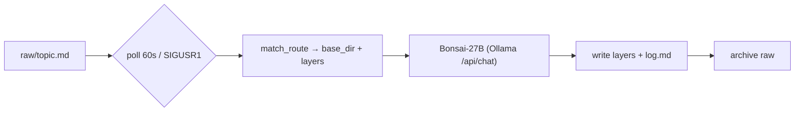

# DSI-Wiki

**Version 0.1a**

Multi-layer wiki generation and serving system. Raw notes dropped into a watched directory are
turned into structured documentation layers (`documentation` / `llm` / `minified`, plus opt-in
`changelog` / `devlog`) by a local LLM (Bonsai-27B over Ollama), and served over HTTP, MCP and a
web UI from a single gateway. One ingest daemon serves any number of wiki instances.

## Architecture

- `_Python/IngestService/` — `DSI-Wiki-Ingest-Service-Class.py`: polling daemon (default 60s,
  or `SIGUSR1`) that routes each `raw/<topic>.md` note to an instance and writes its layers.
  Ingest engine: Bonsai-27B via Ollama `/api/chat` (`stream:false`, `think:false`) — no cloud
  API key required. Also `DSI-Wiki-Nightly-FactCheck.py` (scheduled consistency pass).
- `_Python/HTTPService/` — `api_app.py` (pure functions: `load_instances`, `get_content`,
  `list_topics`, `search`) + `DSI-Wiki-HTTP-Server.py`: combined **API / MCP / UI ASGI gateway
  on port 8430**, mounted at `/api`, `/mcp`, `/http`.
- `_Python/MCPService/` — `DSI-Wiki-MCP-Server.py`: MCP tools `wiki_get` / `wiki_search` /
  `wiki_list_topics` (all require an `instance` parameter). **For external clients only** —
  internal consumers use the CLIs below.
- `_Python/UIService/` — `DSI-Wiki-UI-Server.py`: web UI.
- `_Python/cli/` — local CLIs importing `api_app.py` directly (no server round-trip):
  `wiki_get.py`, `wiki_topics.py`, `wiki_search.py`, `topic_ops.py` (delete/rename),
  `internal_scan.py` (doc-vs-minified drift scan via Bonsai), `provenance.py`.
- `_Python/DSI-Wiki-Service-Supervisor.py` — generates the routing config from instance JSONs,
  installs and keeps the systemd services healthy.
- `_Python/tools/` — maintenance / migration / one-off scripts, **not part of the running
  system** (absent on the `production` branch).
- `Instances/` — one JSON per wiki instance (see Setup).
- `skills/` — SKILL.md definitions for agent consumption (`dsi-wiki-read`,
  `dsi-wiki-internal-scan`, `dsi-wiki-provenance`).

## Setup

```
git clone <repo> && cd DSI-Wiki
./setup.sh
```

`setup.sh` interactively creates `_Python/IngestService/.env` (from `.env.example`), your first
`Instances/<name>.json` (from `default.json`) and runs the supervisor, which generates the
routing config and installs/starts the systemd services (`dsi-wiki-ingest.service`,
`dsi-wiki-http.service`).

Manual equivalent:

1. `cp _Python/IngestService/.env.example _Python/IngestService/.env` and fill it in
   (`LLM_WIKI_RAW_DIR`, `LLM_WIKI_ARCHIVE_DIR`, `LLM_WIKI_POLL_INTERVAL`, `LLM_WIKI_ROUTES`,
   `SERVICE_PORT`).
2. Copy `Instances/default.json` to `Instances/<name>.json`; set `name`, `base_dir`, optional
   `keyword` / `tag`, `enabled: true`.
3. `python3 _Python/DSI-Wiki-Service-Supervisor.py`

Requirements: Python 3, systemd (user services), a local Ollama with the Bonsai-27B model
(override with `LLM_WIKI_OLLAMA_URL` / `LLM_WIKI_OLLAMA_MODEL` env vars).

### Raw vs. base directories

- **Raw is global** — one drop directory for the whole service (`LLM_WIKI_RAW_DIR` in `.env`);
  after successful ingest a note moves to `LLM_WIKI_ARCHIVE_DIR`.
- **Base is per-instance** — each `Instances/<name>.json` sets its own `base_dir`, under which
  that instance's layer folders (`documentation/`, `llm/`, `minified/`, …) are written.
- **Routing (raw → instance):** topic name is matched against each enabled instance's
  `keyword` (substring); a note can force-route with a `Tags: <tag>` line. No match falls back
  to `default_base_dir` in the generated `DSI-Wiki-Multi-Server-Config.json`.
- **`DSI-Wiki-Multi-Server-Config.json` is generated, never hand-edited** — re-run the
  supervisor after any instance change. If it is ever reset to the empty committed template,
  the ingest service will crash-loop on the first unrouted note; fix by re-running the
  supervisor.

### Layers

Defined per instance in the `layers` field of `Instances/<name>.json`:

- `documentation` — free-form per instance: custom `prompt` and/or literal layer instructions
  in the instance JSON (see `Documentation_Example_schema.md` for the MAIN_/SUB_/INDEP_/OBSOLETE_
  key format).
- `llm`, `minified`, `changelog`, `devlog` — standard layers (`standard: true`) with prompts
  resolved from the instance JSON; per-topic `topic_layers` entries can override with literal
  `D:` / `C:` / `R:` / `X:` directives.
- Instances with no `layers` field fall back to the fixed 3-layer
  (`documentation`/`llm`/`minified`) behavior.

## Lifecycle



## Usage

**Write:** drop a note at `raw/<topic>.md` — picked up within one poll interval.

**Read (internal, CLI — the standard path):**

```
DSI-wiki-topics [--instance <name>] [--layer minified]
DSI-wiki-get <topic> [--instance <name>] [--layer minified]
DSI-wiki-search <query> [--instance <name>] [--layer all]
DSI-wiki-rename <old> <new>        # across all layers
DSI-wiki-delete <topic>            # across all layers
DSI-wiki-internal-scan --topic <t> | --all   # doc-vs-minified drift report
```

(Wrappers in `~/.local/bin/` → `_Python/cli/*.py`; they read the layer files directly.)

**Read (external):** HTTP gateway on `:8430` — `GET /api/instances`,
`GET /api/topics?instance=&layer=`, `GET /api/wiki?instance=&topic=&layer=`,
`GET /api/search?instance=&q=&layer=`; MCP at `/mcp` with the same three tools.

**Add an instance:** new JSON under `Instances/`, then re-run the supervisor.

## Branches

- `production` — running, stable code (no `_Python/tools/`)
- `development` — active development
- `documentation` — full version of this README
- `LLM` — condensed bullet summary for quick context transfer
- `Mini` — single-paragraph gist
